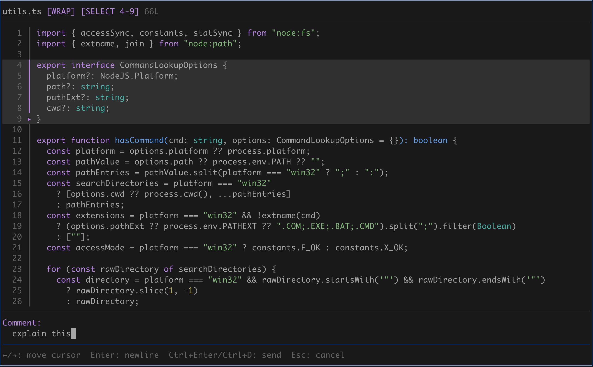

# pi-files-widget-overlay
This is an overlay-focused fork of [tmustier/pi-extensions — files-widget](https://github.com/tmustier/pi-extensions/tree/main/files-widget). No `bat`, `glow`, or `delta` required.

In-terminal floating-overlay file browser and diff viewer for Pi. Navigate files, view diffs, select code, and send comments to the agent without leaving the terminal and without interrupting your agent.



## Install

**Quick install (Pi package manager):**

```bash
pi install npm:pi-files-widget-overlay
```

**Local development:** add the repository path to `~/.pi/agent/settings.json`:

```json
{
  "extensions": [
    "~/pi-files-widget-overlay"
  ]
}
```
## Dependencies

- Pi v0.85.0 or later
- Pi built-in syntax highlighter: code colors follow the active Pi theme
- Pi built-in Markdown renderer: rendered Markdown follows the active Pi theme

The `/readfiles` browser has no `bat`, `glow`, or `delta` runtime dependency. Code, Markdown, and unified diffs use Pi's theme-aware renderers; Diff mode uses `git` when available.

## Project layout

- `src/`: extension runtime and `/readfiles` entry point
- `test/`: browser and viewer regression tests
- `docs/`: design notes and anonymous benchmark baselines
- `benchmarks/`: locally run benchmark harnesses; excluded from the published package

## Development

```bash
npm install
npm test
npm run typecheck
```

## Commands

- `/readfiles` - open the file browser as a floating overlay in the current directory
- `/readfiles <path>` - open the floating browser rooted at `<path>` (absolute, relative, or `~`-prefixed)

A no-argument reopen during the same Pi session restores the last selected file in its directory, or the last browser directory when no file was selected, while preserving the original browser root for `.`. The header briefly shows `↳ restored: <path>` until the next input. This temporary state is never written to disk; an explicit `<path>` starts there instead.
The overlay is centered at 95% of terminal width with a one-cell margin. Its framed header shows the current browser root and scan activity, and separates the browser from the agent transcript. In browser mode, `q` or `Esc` closes the overlay and returns focus to Pi.
Diff viewing is built into the file viewer: open a changed tracked file and press `d` to toggle the git diff view.

On wide terminals, the browser shows a read-only 3:7 tree/preview split. The preview follows the selected item; `g/G`, `PgUp/PgDn`, `Ctrl-U/Ctrl-D`, and `w` control the preview without enabling edits. Its page keys scroll the preview content by half a page.

## Browser Keybindings

- `j/k` or `↑/↓`: move
- `Enter`: open file / expand folder
- `h/l` or `←/→`: collapse/expand folder
- `p`: toggle the wide-terminal tree/preview split
- `PgUp/PgDn`: page the browser tree in the narrow single-column layout
- `c`: toggle changed-only view
- `C`: toggle the expanded changed view; enabling it expands every directory containing changes
- `]` / `[`: next/prev changed file
- `/`: filter by filename (type to filter; press `/` again to clear, or `Esc` / `Backspace` on an empty query to exit)
- `@`: asynchronously filter by literal file content; press `@` again to clear, or `Esc` / `Backspace` on an empty query to cancel.
- `u`: go up one directory (re-root to parent)
- `.`: jump back to the starting directory
- `+` / `-`: increase/decrease browser height
- `?`: toggle full keybindings
- `q`: close

## Viewer Keybindings

- `j/k` or `↑/↓`: move the line cursor (the viewport follows it)
- `PgUp/PgDn` or `Ctrl-U/Ctrl-D`: scroll content up/down half a page; retain the current line when it remains visible, otherwise move it to the first visible line
- `g/G`: top/bottom; `<count>G` jumps to a logical line in the current view (for example, `12G`)
- `d`: toggle diff (tracked files only)
- `m`: toggle rendered/raw view for Markdown files
- `w`: toggle word wrap (disabled by default)
- `/`: search (press `/` again to clear; `Esc` or `Backspace` on an empty query exits)
- `n` / `N`: next/prev match
- `v`: select mode (line selection)
- `c`: comment on selected lines (inline prompt)
- `C` (while selecting): comment on the whole file as `@file: comment`
- `Enter`: new line in the comment editor
- `←` / `→` (comment editor): move the editing cursor
- `Ctrl+Enter` or `Ctrl+D`: send the comment (`Alt+Enter` also works when supported)
- `]` / `[`: next/prev changed file
- `+` / `-`: increase/decrease viewer height
- `?`: toggle full keybindings
- `q`, `Esc`, or `←`: back to browser

## Notes

- Supported platforms: macOS and Linux terminals supported by Pi; the CI matrix runs both platforms.
- The overlay maximum height is 95% of the terminal; browser and viewer panels start at 85%, and `+` / `-` adjust within that available range.
- Hidden project files and directories such as `.pi/` and `.github/` are visible; `.git/` and common dependency/build caches remain hidden.
- Directory symlinks have a `↗` marker and can be expanded like normal folders.
- Untracked files show as `[UNTRACKED]` and open in normal view.
- Searching in rendered Markdown switches to raw mode first, and selecting from rendered Markdown first switches you back to raw so line-based matches and comments stay aligned with the source file. On terminal-width changes, rendered Markdown retains the current paragraph when it can match its text; otherwise it resets to the top.
- When you browse outside the current project directory, inline comments on those files use absolute paths so the agent can still locate them. Files inside the project continue to use project-relative paths.
- Folder LOCs are shown only when the folder is collapsed (expanded folders would duplicate counts).
- Image, binary, and terminal-control-character files display a safe metadata placeholder in the overlay instead of attempting to render their bytes. Open them externally to inspect them.
- Line counts load asynchronously without interrupting browsing; the Files title shows activity only while a directory scan is in progress.
- Large non-git folders load progressively and may show `[partial]` while loading in safe mode.
- Git status refreshes every 3 seconds while `/readfiles` is open.
