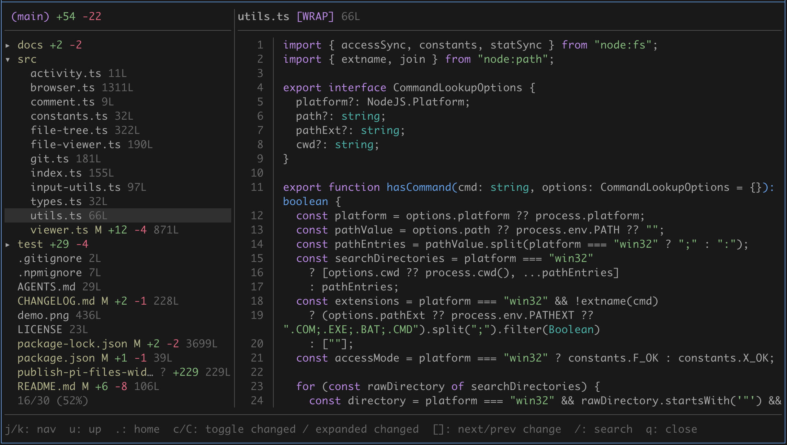

# pi-files-widget-overlay

In-terminal floating-overlay file browser and diff viewer for Pi. Navigate files, view diffs, select code, and send comments to the agent without leaving the terminal and without interrupting your agent.

## Origin

Forked from [tmustier/pi-extensions — files-widget](https://github.com/tmustier/pi-extensions/tree/main/files-widget), distributed under the MIT License. Modifications and overlay-focused maintenance are by tallshort.

Directory symlinks are shown with a `↗` marker and can be expanded like normal folders.


## Install

**Quick install (Pi package manager):**

```bash
pi install npm:pi-files-widget-overlay
```

**Local development:** add the repository path to `~/.pi/agent/settings.json`:

```json
{
  "extensions": [
    "~/pi-files-widget-overlay"
  ]
}
```
## Dependencies

- Pi built-in syntax highlighter: code colors follow the active Pi theme
- Pi built-in Markdown renderer: rendered Markdown follows the active Pi theme

The `/readfiles` browser has no `bat`, `glow`, or `delta` runtime dependency. Code, Markdown, and unified diffs use Pi's theme-aware renderers; Diff mode uses `git` when available.

## Project layout

- `src/`: extension runtime and `/readfiles` entry point
- `test/`: browser and viewer regression tests
- `docs/`: design notes and anonymous benchmark baselines
- `benchmarks/`: locally run benchmark harnesses; excluded from the published package

## Development

```bash
npm install
npm test
npm run typecheck
```

## Commands

- `/readfiles` - open the file browser as a floating overlay in the current directory
- `/readfiles <path>` - open the floating browser rooted at `<path>` (absolute, relative, or `~`-prefixed)

The overlay is centered at 95% of terminal width with a one-cell margin. Its framed header separates the browser from the agent transcript; `q` or `Esc` closes it and returns focus to Pi.
Diff viewing is built into the file viewer: open a changed tracked file and press `d` to toggle the git diff view.

On wide terminals, the browser shows a read-only 3:7 tree/preview split. The preview follows the selected item; narrow terminals retain the single-column browser. In split view, `g/G`, `PgUp/PgDn`, and `Ctrl-U/Ctrl-D` scroll the preview without enabling editing.

## Browser Keybindings

- `j/k` or `↑/↓`: move
- `Enter`: open file / expand folder
- `h/l` or `←/→`: collapse/expand folder
- `PgUp/PgDn`: page up/down
- `c`: toggle changed-only view
- `C`: toggle the expanded changed view; enabling it expands every directory containing changes
- `]` / `[`: next/prev changed file
- `/`: search (type to filter, `Esc` to exit)
- `u`: go up one directory (re-root to parent)
- `.`: jump back to the starting directory
- `+` / `-`: increase/decrease browser height
- `q`: close

## Viewer Keybindings

- `j/k` or `↑/↓`: move the line cursor (the viewport follows it)
- `PgUp/PgDn` or `Ctrl-U/Ctrl-D`: move up/down half a page
- `g/G`: top/bottom
- `d`: toggle diff (tracked files only)
- `m`: toggle rendered/raw view for Markdown files
- `w`: toggle word wrap (disabled by default)
- `/`: search (type to search)
- `n` / `N`: next/prev match
- `v`: select mode (line selection)
- `c`: comment on selected lines (inline prompt)
- `Enter`: new line in the comment editor
- `Ctrl+Enter` or `Ctrl+D`: send the comment (`Alt+Enter` also works when supported)
- `]` / `[`: next/prev changed file
- `+` / `-`: increase/decrease viewer height
- `q`, `Esc`, or `←`: back to browser

## Notes

- The overlay maximum height is 95% of the terminal; browser and viewer panels start at 85%, and `+` / `-` adjust within that available range.
- Hidden project files and directories such as `.pi/` and `.github/` are visible; `.git/` and common dependency/build caches remain hidden.
- Untracked files show as `[UNTRACKED]` and open in normal view.
- Searching in rendered Markdown switches to raw mode first, and selecting from rendered Markdown first switches you back to raw so line-based matches and comments stay aligned with the source file. On terminal-width changes, rendered Markdown retains the current paragraph when it can match its text; otherwise it resets to the top.
- When you browse outside the current project directory, inline comments on those files use absolute paths so the agent can still locate them. Files inside the project continue to use project-relative paths.
- Folder LOCs are shown only when the folder is collapsed (expanded folders would duplicate counts).
- Image files display a safe placeholder in the overlay instead of attempting to render binary data. Open them in an external image viewer.
- Line counts load asynchronously; the header shows activity while counts are computed.
- Large non-git folders load progressively and may show `[partial]` while loading in safe mode.
- Git status refreshes every 3 seconds while `/readfiles` is open.
